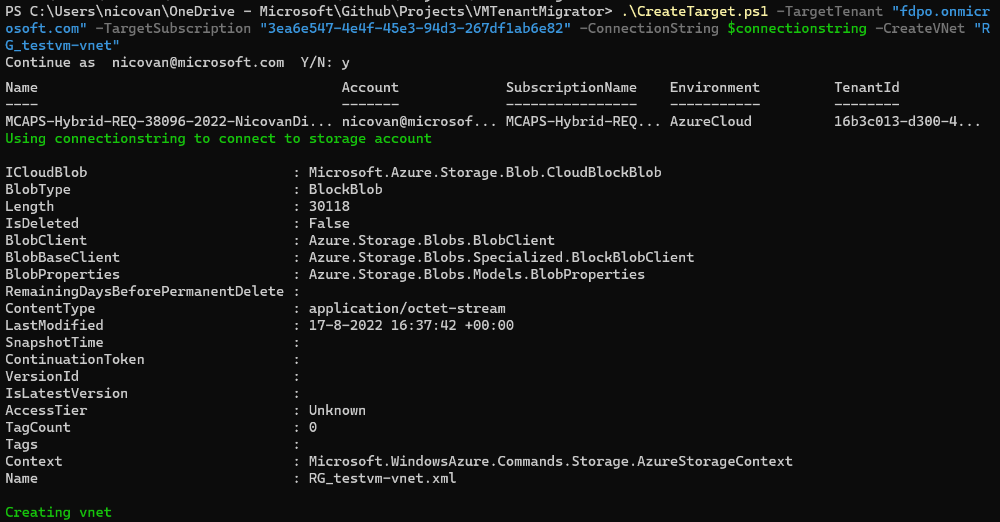

# VMTenantMigrator
Set of scripts for migrating Azure VMs to a subscription in another tenant.

I didn't spend much time on making the code very pretty or providing different options. It is meant to do a task that you will probably don't have to do very often. Also there is code that is not used (yet).

If you find a bug or have an improvement feel free to do a pull request.

## Overview

The migration is a two step process.

The first step is to export all the config to XML files in a storage account in the target tenant. The disks will also be copied over.

The second step is to recreate the objects in the target tenant.

The solution has three scripts:
- Prep_Target.ps1 : Creates a storage account and optionally a VM to run the migration scripts.
- GetSource.ps1 : Exports the objects from the old tenant to the storage account.
- CreateTarget.ps1 : Creates the objects in the target subscription from the files in the storage account.

## Usage

### Prep_target.ps1

This script is used to create the supporting objects in the target enviroment:
- Storage Account
- Optional: VM to run the migration scripts on. Also useful for limiting network access to the storage account.

**Syntax**
  >.\Prep_Target.ps1 -TargetTenant <Tenant_name> -targetsubscription <Subscription_GUID> -location <Region_name> [-migvmname <VM_Name>] 

**Example**

  >.\Prep_Target.ps1 -TargetTenant fdpo.onmicrosoft.com -targetsubscription "3ea6e547-4e4f-45e3-94d3-267df1ab6e82" -location westeurope

### getsource.ps1

Script to export objects to storage account in the target subscription.

Script has several runmodes:
- MigrateSingleVM : By default the script will export all VMs. You can use migratesinglevm with the value of the vm name to migrate a single vm.
- nodisk : Will skip the disk upload. Used this for debugging because I got tired of the overwrite notifications.
- ExportVnets : Will export all Vnets in the source subscription.

**Syntax**
  >.\GetSource.ps1 -tempdir <Temp_folder_for_XMLFiles> -sourcetenant <Tenant_Name> -sourcesubscription <Subscription_GUID> -connectionstring <StorageAccount_ConnectionString> [-nodisk] [-ExportVnets]

Provide the connectionstring found in the Access Keys section of the storage account. I usually put that in a separate variable.

**Example**

  >.\GetSource.ps1 -tempdir c:\temp\migrate -sourcetenant "microsoft.onmicrosoft.com" -sourcesubscription "3ea6e547-4e4f-45e3-94d3-267df1ab6e82" -connectionstring $ConnectionString -ExportVnets

It can take some time for the copy to complete in the background. You can see if the copy is completed through the portal.

## Createtarget.ps1

This script will create the resources in the target environment. It currently only supports migrating 1 vm per run. But you can build a wrapper around it (foreach) to process a list of VMs.

The script has two run-modes:
- Use the **creaetvnet** switch to create a vNet. Again only 1 per run.
- Use **MigrateVM** to create a VM. (The vnet has to exist first).

**Syntax**
  >.\CreateTarget.ps1 -TargetTenant <Tenant_Name> -TargetSubscription <Subscription_GUID> -ConnectionString <connection_string> [-CreateVNet <vNet_Name>] [-MigrateVM <VM_Name>]

**Example creating vNet**

  >.\CreateTarget.ps1 -TargetTenant "fdpo.onmicrosoft.com" -TargetSubscription "3ea6e547-4e4f-45e3-94d3-267df1ab6e82" -ConnectionString $connectionstring -CreateVNet "RG_testvm-vnet"

**Example creating VM**

  >.\CreateTarget.ps1 -TargetTenant "fdpo.onmicrosoft.com" -TargetSubscription "3ea6e547-4e4f-45e3-94d3-267df1ab6e82" -ConnectionString $connectionstring -MigrateVM "esae-dc01"

  